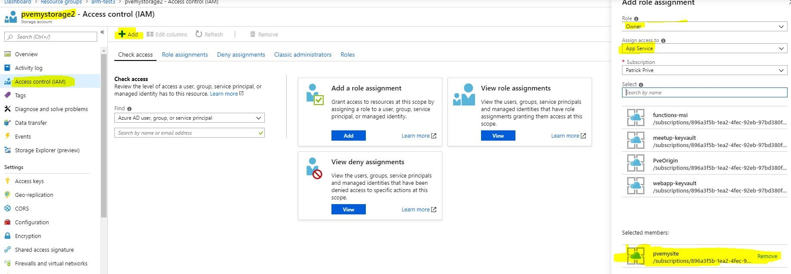

## Deploying

Get yourself a storageaccount and a website:

## Setting up Role-Based-Access-Control

After deployment you have a website (+ hosting) and a storageaccount.

Managed Identity is already enabled on the website for you!

After deployment to to your **storage account** en select **Access Control** and select **Add**.

Select the role of **Storage Blob Data Owner**, select **App Service** and then select the website you just deployed.

After like 2/3 minutes the website has passwordless access to your storage account.

## Setting up website code

1. Clone the github project into your local disk.
2. Open the project in the **Code** folder with **Visual Studio**
3. Open `TestController` in the **Controllers** folder
4. Enter your storage account name in the `MyStorageAccountName` variable.
5. Deploy to azure

6. Visit your website.
7. Read the code in the controller to get understanding how the passwordless SDK works.

If all the steps are followed correctly, your website will:

* Connect to the storage account in a passwordless manner
* Create a blob-container
* Create a blob
* Upload text
* Show text in browser

